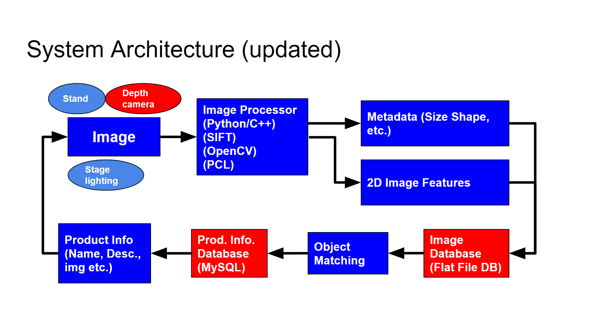

# EC601 Retail Product Imager

Team: Vivian Pazmany, Chenhui "Elvis" Zhu, Matthew Boyd  
TA: Yicun (Ethan)

*Updated: 10/30/2019*

#### Contents

* [Product Mission](#product-mission)
* [Customer & User Stories](#user-stories)
* [System Design](#system-design)
* [Minimum Viable Product (MVP)](#mvp)
* [Technology Selections](#technology-selections)
* [Technology Justifications](#technology-justifications)
* [Competitors](#competitors)
* [Competitors' User Stories](#competitors-user-stories)
* [Patent Analysis](#patent-analysis)
* [Flowchart](#flowchart)

<a name="product-mission"/>

## Product Mission

Use ~~stereo cameras~~ depth camera to measure object size and determine rough object shape, then use image recognition to match visible graphics with database of known products to identify retail products in a "cluttered" box of products.

<a name="user-stories"/>

## Customer & User Stories

CUSTOMER: Retail stores w/pick up/delivery services like Target, Walmart etc.

- I, the store manager, would like to improve the product sorting process to optimize the time of the human picked orders.
- I, a retail worker, would like to help customers while an automated system handles the back-room product sorting.
- I, the store manager, would like to be able to add new products easily for image recognition & sorting rather than training human workers about new products or bring in the vendor to image new products.
- I, the store manager, want to save worker time by them not having to orient items to show the bar code in the picked box of items, esp. for heavy objects.
- I, as supervisor, do not want to have to approve each image of the product that pops up. The autonomous system should detect and continuously match products after each product is removed from the pile.

<a name="system-design"/>

## System Design

<a name="mvp"/>

## Minimum Viable Product (MVP)

Capability of recognizing the top object in a box of 5 known stacked objects of hard-edged dimensions (no bottles) using our stereo camera system and reference database.

<a name="technology-selections"/>

## Technology Selections

**Software**

Language: Python, C++, Javascript (GUI)

Single Image feature extraction: SIFT

~~Database: VDMS~~  
*No longer using VDMS because of issues getting results and persisting data in their provided Docker image. Installing the VDMS software directly would never complete. Suspect it is still too new and has too many bugs for us to use.*

**Image Serach: FLANN over stored list of extracted features**  
*Using this in place of VDMS for feature matching*

**Feature Storage: Local binary files**  
*Using this in place of VDMS for feature storage*

**Product Database: MySQL**  
*Using this in place of VDMS for storing product information*

**GUI Application: TBD**

Depth image metadata extraction (3D): **Intel RealSense SDK**

**Hardware**

Lighting: Matt's LED's

~~Image Capture: Stereo Pi w/ Rasperberry Pi 3B+ 1.4GHz~~  
*No longer using - had trouble getting stereo images to convert to point clouds quickly and efficiently. Process was taking minutes per image - we desire sub-second performance.*

**Image Capture: Intel RealSense D415 camera module**

Laptop: GUI, Image Capture, Image+Feature Storage & Search, Product Database 

Camera Mount: metal shelf

~~Camera Case: Epic 3D print~~  
*No longer needed - for StereoPi*

<a name="technology-justifications"/>

## Technology Justifications

#### Why not use ML?
As a product intended for use in a retail environment, where 30K-100K individual product SKUs are easily possible, training an ML model to detect a product would require tremendous effort. Not only would we need multiple *tagged* images of each product, but the matching would be extremely slow. Typical "state of the art" ML today can only match a few dozen items with any given model. We are looking to match tens of thousands of products. ML seems a poor fit given our very controlled environment. 

#### Language: Python and C++
- All libraries and tools selected support both languages
- Our team has expertise in both
- Python is good for development and testing, but slower
- C++ is faster, but more cumbersome and slower to code

#### Single Image feature extraction: Sift
Comparison of SURF, SIFT, and ORB:
- Number of feature points detected: SURF > ORB > SIFT
- Detection time: ORB > SURF > SIFT
- Scaling: SIFT > SURF > ORB
- Rotation: SIFT > ORB/SURF

All in all, the SIFT is the best algorithm for our project. This is because that the most important part is attached to the performance when deal with the scaled or rotated images rather than the detection speed.

~~Database: VDMS~~  
*No longer using VDMS because of issues getting results and persisting data in their provided Docker image. Installing the VDMS software directly would never complete. Suspect it is still too new and has too many bugs for us to use.*

#### Feature Search: FLANN *(Replaces VDMS)*
- Supports saving indexes to disk - allows us to continue to segment image database by object size. 
- After indexes are built, searching is very quick (<100 ms).

#### Product Information Database: MySQL *(Replaces VDMS)*
- Free and easy to use.
- Matt has expertise with RDBMSes 

~~Image Capture: Stereo Pi w/ Rasperberry Pi 3B+~~  
*No longer using - had trouble getting stereo images to convert to point clouds quickly and efficiently. Process was taking minutes per image - we desire sub-second performance.*

#### Image Capture: Intel RealSense D415 camera module *(Replaces StereoPi)*
- Generates depth images directly.
- Relatively inexpensive.
- Widely used, so lots of tutorials and community support. 

#### Stereo image metadata extraction: Intel RealSense SDK
- Works with Intel RealSense camera module.
- Easy support for generating point clouds, measuring objects, etc.
- Widely used, so lots of tutorials and community support. 

#### GUI Application: TBD

<a name="competitors"/>

## Competitors

**Kwikee** (kwikee.com)

- Retail product imaging for ecommerce
- Database of product attributes

**Trax** (traxretail.com)

- Shelf/product imaging for retail inventory management

**Aifi** (aifi.io)

- Auto checkout system (cashierless stores)

**Cashierless store tech in general...**
- Aifi, Standard Cognition, Zippin, Trigo Vision, etc.

**Simple Robotics**

- Inventory robot (on-shelf inventory)

<a name="competitors-user-stories"/>

## Competitors' User stories

**Trax:**
1. I, as retailer, improve the operational efficiency by the leveraging real-time shelf data. Trax helps retailer to understand current levels of out of stocks for core products.

**Kwikee:**
1. For retailer, they can use kwikee to improve their products’ brand stories, manage the products images they need.

**AIFI:**
1. I, as retailers, can easily track customers, inventory and behavior to get real-time insights into what's working and what isn't.
2. I, as customer, can fill their carts and maybe even putting items back where they don't belong.

<a name="patent-analysis"/>

## Patent Analysis

1. Automatic sorting machine for sorting and classifying small products of the pharmaceutical and confectionery industries according to form and color: https://patents.google.com/patent/US5558231A/en

2. Facial recognition patents:
   - Apple:
https://www.patentlyapple.com/patently-apple/2011/11/apple-wins-secret-patent-for-high-end-3d-object-recognition.html
   - "A method, device, system, and computer program for object recognition of a 3D object of a certain object class using a statistical shape model for recovering 3D shapes from a 2D representation":
https://patents.google.com/patent/US20120114251A1/en

3. 3D object recognition using a single camera image to identify the object through comparison with the camera coordinate system:
https://patents.google.com/patent/US8379014B2/en

4. Object recognition system using position sensor, image sensor, and controller: https://patents.google.com/patent/US6792147

5. Vehicle object recognition system: "A method and system for detecting and tracking objects near a vehicle using a three dimensional laser rangefinder" :
https://patents.google.com/patent/US8260539

6. US gov. Vehicle object recognition patent: "The platform provides an automated tool that can integrate multi-modal sensor data including two-dimensional image data, three-dimensional image data, and motion, location, or orientation data, and create a visual representation of the integrated sensor data, in a live operational environment.": https://patents.justia.com/patent/9911340

<a name="flowchart"/>

## Flowchart
